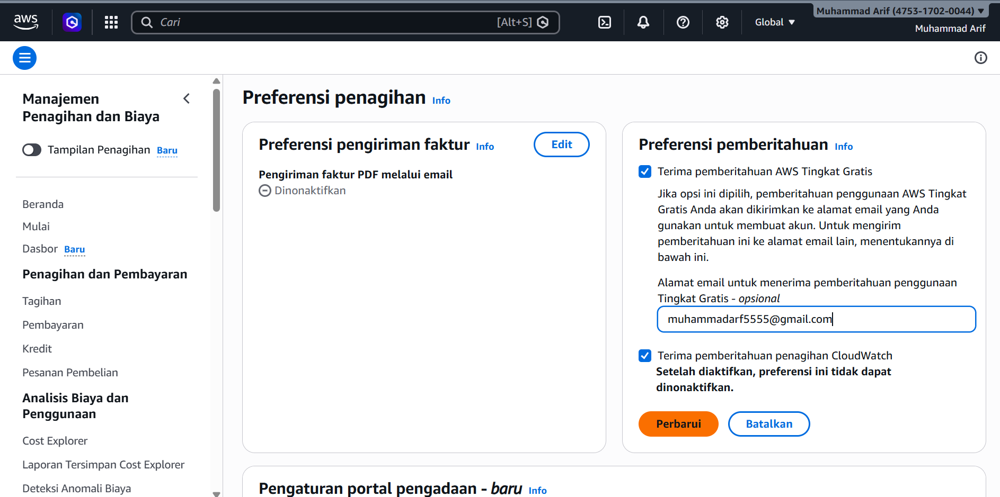
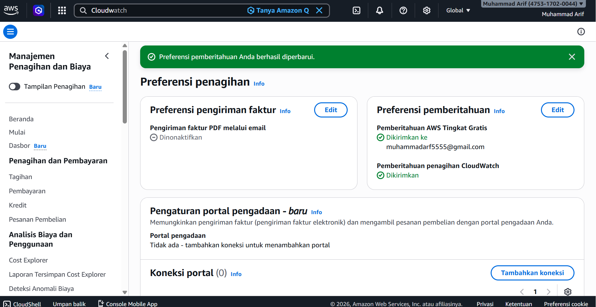
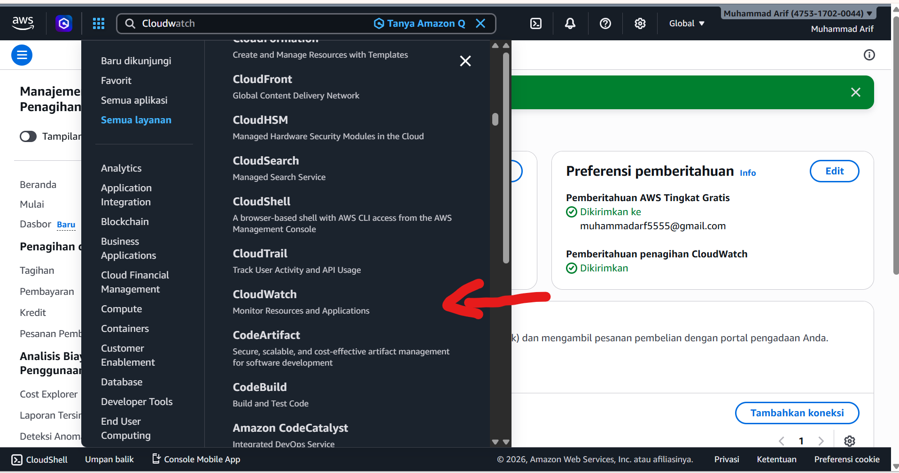
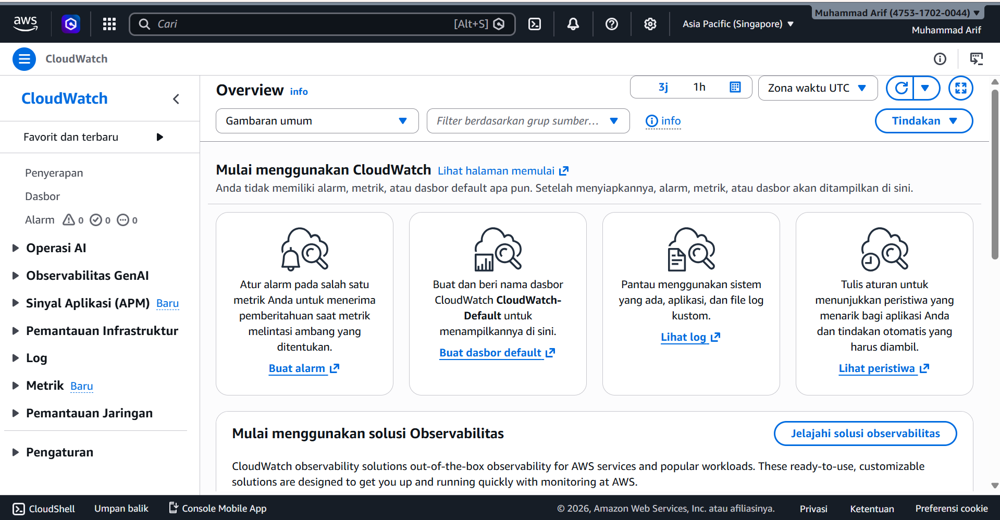
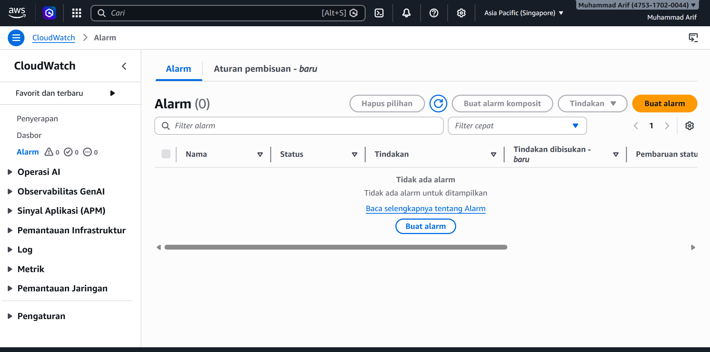
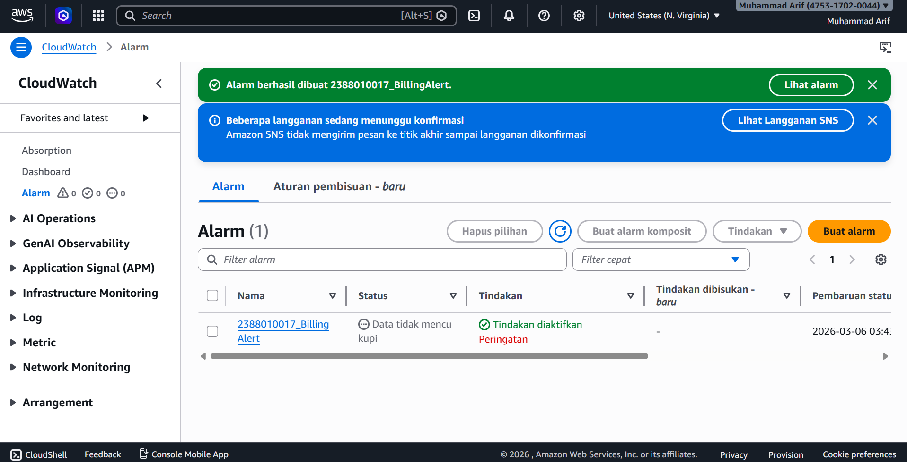

# Membuat Billing Alert di AWS untuk menghindari kelebihan alokasi Dana

1.membuat Dashboard AWS kita pilih Billing preference untuk mengatifkan Alert
-Masuk Menu Billing and Cost Manajemen
-Pada Menu Cost Manajement Scroll ke bawah pilih Billing Preferences
-pilih Menu Alert Preference Klik Edit
-isi Email ceklis Receive
-Klik Update
  

2.Masuk Menu Cloudwatch,All Services Pilih CloudWatch

3.Pilih Menu Create Alarm
-Pastikan Region ada di US N Virginia
-Klik Menu Create ALert
-Klik Metric
-Klik Menu Billing
-Pilih Menu Total Estimated Charge
-Pilih / Ceklis Mata Uang USD
-Klik Select Metric
-beri nama Alert = NIM_BillingAlert
-Conditions Static->Greathertha-> 1 USD
-Create new Topic = > NIM_BillingAlert -> Klik Create
-Select an existing SNS topic - > NIM_BillingAlert
-Klik Next
-Alarm Name -> NIM_BillingAlert
-Create Alarm
-Buka Inbox/Spam Email dari AWS kemudian Klik Confirm

