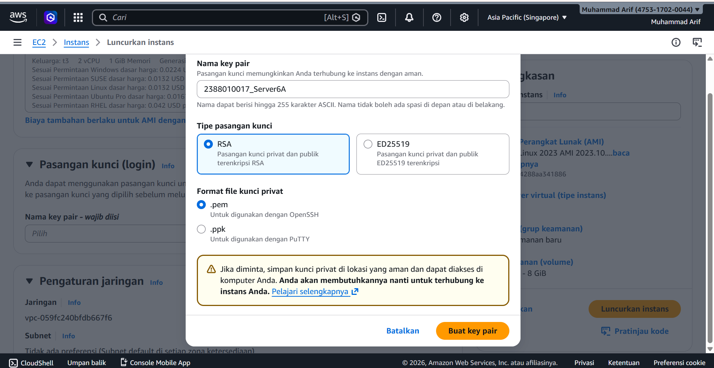
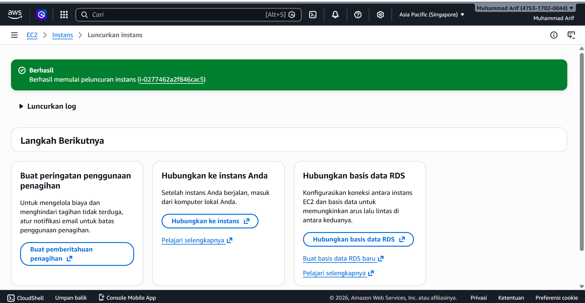
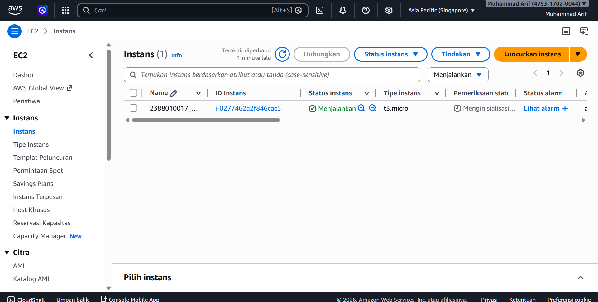

# Membuat VM / Instance di AWS EC2 dgn AMI
1.Buka Menu EC2 dari Dashboard
2.Klik Menu Launch Instance
3.Pastikan Region memilih terdekat
4.Isi Nama Instance -> NIM_Server6A
5.OS pilih Linux Ubuntu
6.Instance Type pilih T3.Micro
7.Membuat Key Pair -> Create new Key Pair -> Isi Nama -> file .Pem -> Create
8.Network Security
-Allow SSH Traffic
-Allow HTTPS
-Allow HTTP
9.Storage Setting -> 30Gb

10.Klik Launch Instance

11.Pastikan Alert Success

