# TechNime Blog & CV Statis - UAS Cloud Native & CI/CD
Aplikasi Web Multi-Kontainer dengan GitHub Actions CI/CD & AWS Deployment

---
* **Nama:** Muhammad Arif Rizky
* **NIM:** 2388010017
* **Mata Kuliah:** Administrasi Server
* **Instansi:** UIN Siber Syekh Nurjati Cirebon

1. membuat instance baru
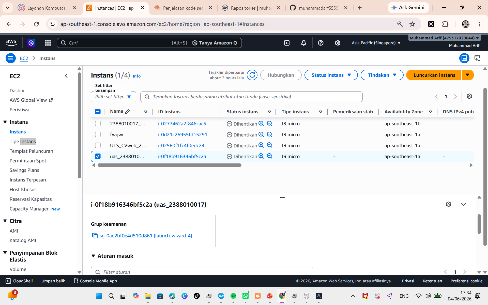
2. membuat repositori baru di docker yaitu repo buat wb dininamis dan repositori buat web statis
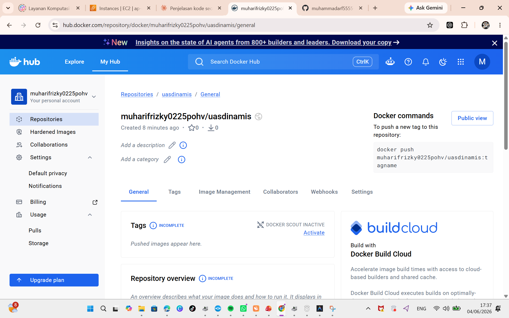
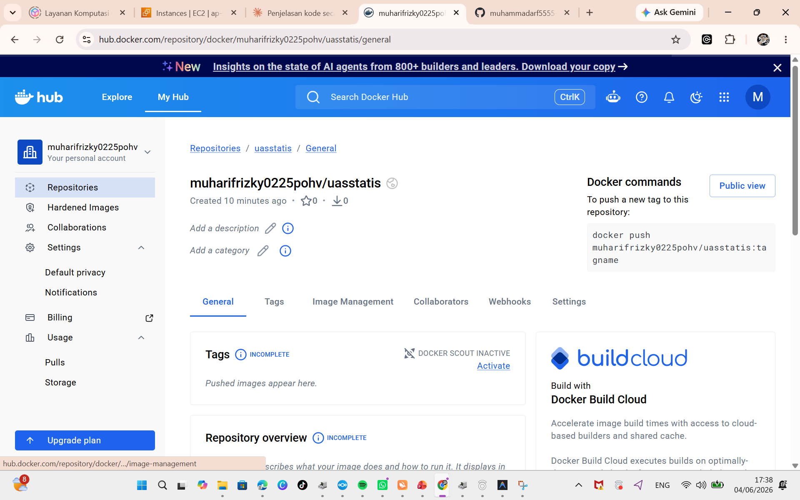
3. membuat code php untuk web dinamis  
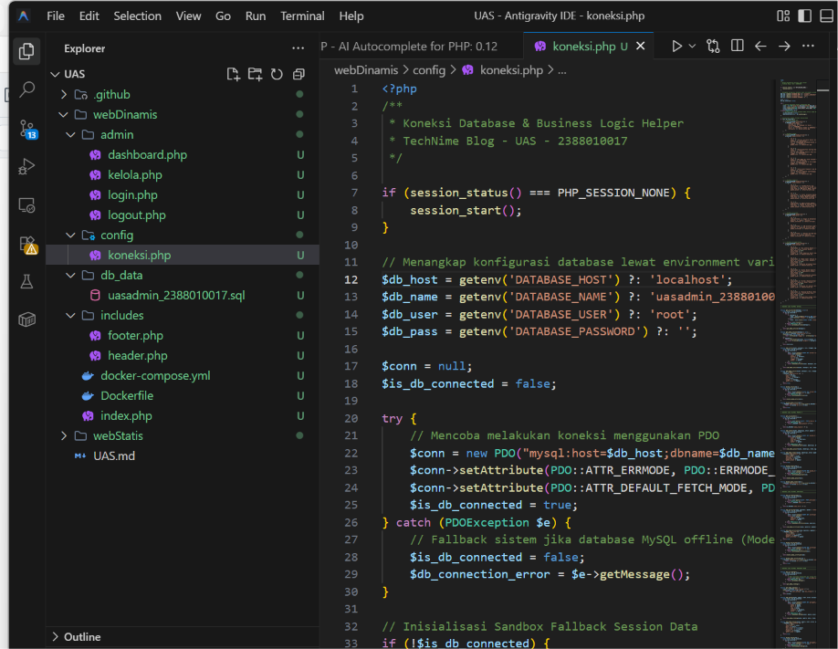

### 4. Install Docker 
    "sudo apt update"
    "sudo apt install -y ca-certificates curl gnupg"
    "sudo install -m 0755 -d /etc/apt/keyrings"
    "curl -fsSL https://download.docker.com/linux/ubuntu/gpg | sudo gpg --dearmor -o /etc/apt/keyrings/docker.gpg"
    "sudo chmod a+r /etc/apt/keyrings/docker.gpg"
    ". /etc/os-release"
    "echo "deb [arch=$(dpkg --print-architecture) signed-by=/etc/apt/keyrings/docker.gpg] https://download docker.com/linux/ubuntu ${VERSION_CODENAME} stable" | sudo tee /etc/apt/sources.list.d/docker.list > /dev/ null"
    "sudo apt update"
    "sudo apt install -y docker-ce docker-ce-cli containerd.io docker-buildx-plugin docker-compose-plugin"

    LALU CEK APAKAH DOCKER BERHASIL DIINSTALL
    "docker --version"
    "docker compose version"

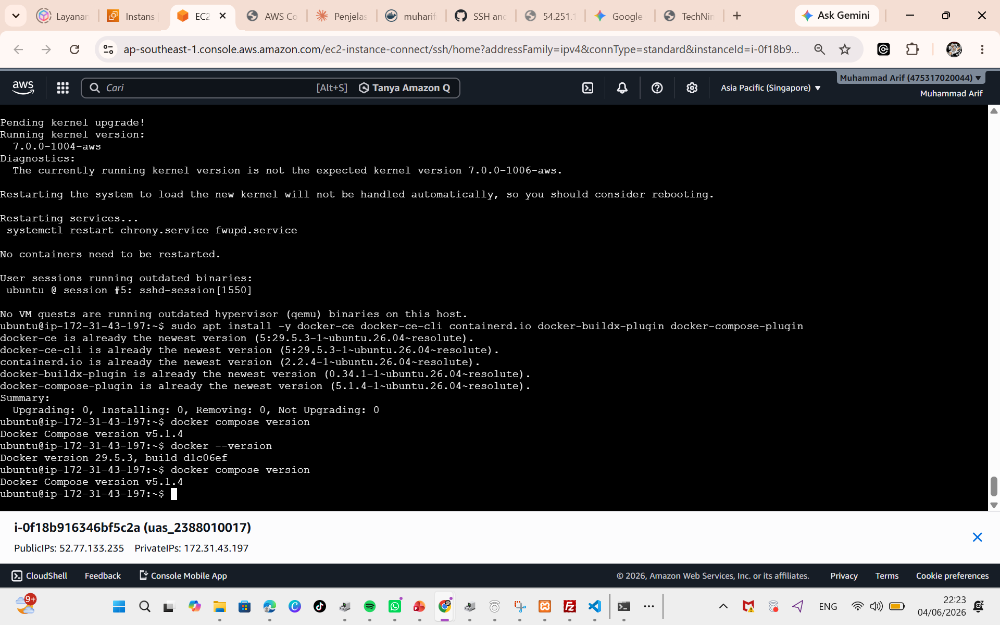
 5.  LALU JALANKAN DOCKER COMPOSE
    "cd ~/uas"
    "docker compose config"
    "docker compose up -d --build"

    LALU CEK CONTAINER
    "docker compose ps"
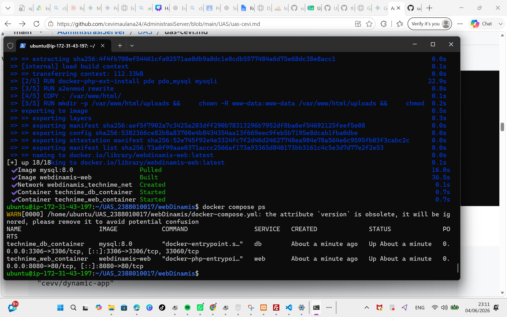
7. Set Up Github Action
    ".github/workflows/deploy-static.yml"
    ".github/workflows/deploy-dynamic.yml"

    COMMIT & PUSH WORKFLOW
    "git status"
    "git add .github/workflows/deploy-static.yml .github/workflows/deploy-dynamic.yml"
    "git commit -m "Add GitHub Actions deployment workflows""
    "git push origin main"
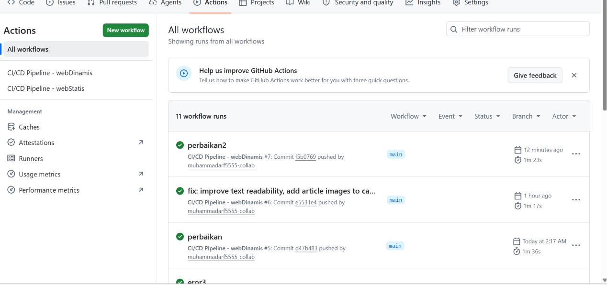
8.  BUAT ACCESS TOKEN DOCKER HUB
    "Account Settings -> Personal access tokens -> Generate new token"
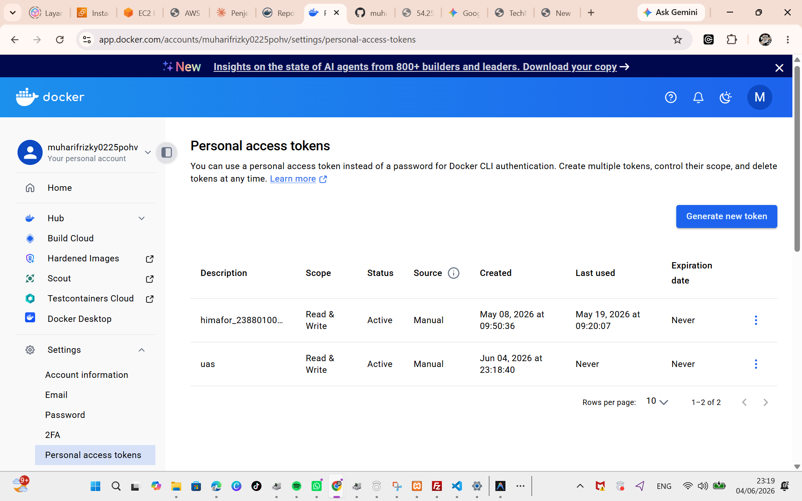
9.  DOCKERHUB_USERNAME=muharifrizky0225pohv
    DOCKERHUB_TOKEN=token_dockerhub_kamu
    EC2_HOST=47.128.217.195
    EC2_USER=ubuntu
    EC2_SSH_KEY=isi_private_key_pem
    DB_NAME=uas_2388010017
    DB_USER=uas_user
    DB_PASSWORD=arif1234567891123
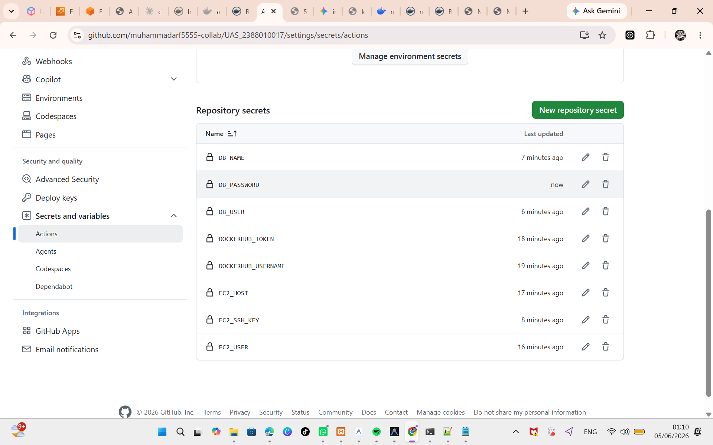
 10. Live Test Zero Touch

11. mengekill web yang sedang jalan agar tidak eror
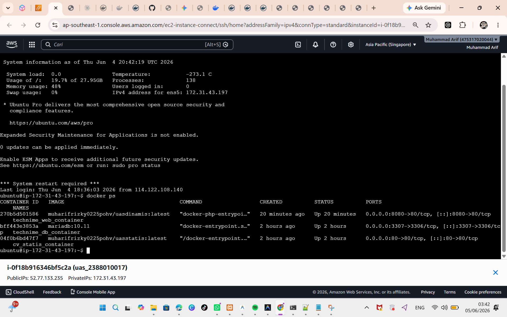
12. web statis
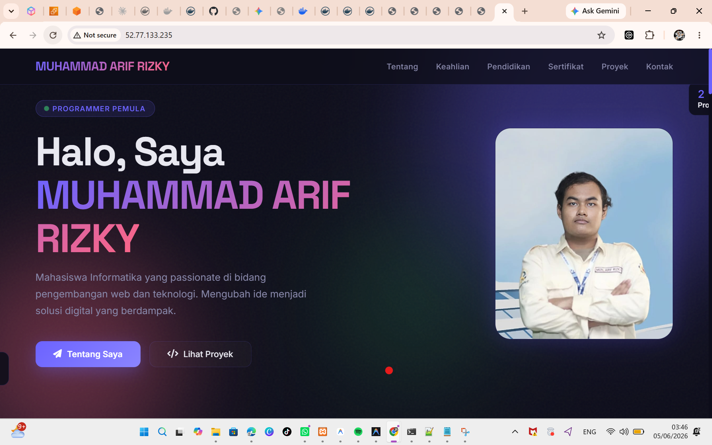
13. tampilan web dinamis halaman home
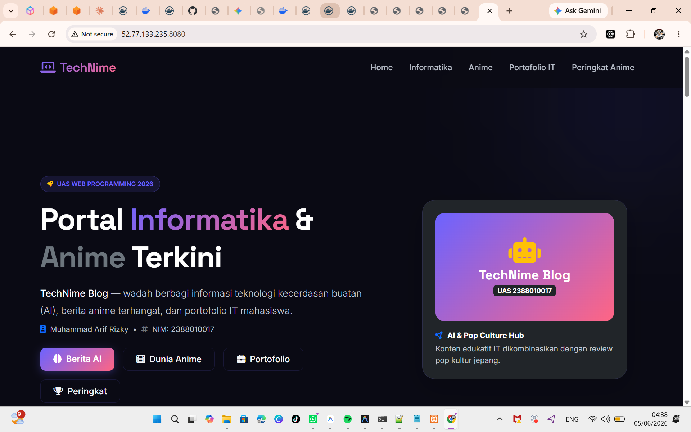
14. tampilan halaman admin
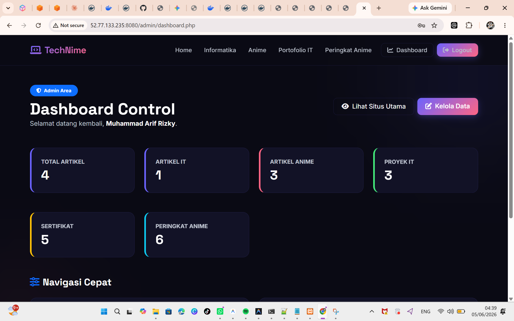
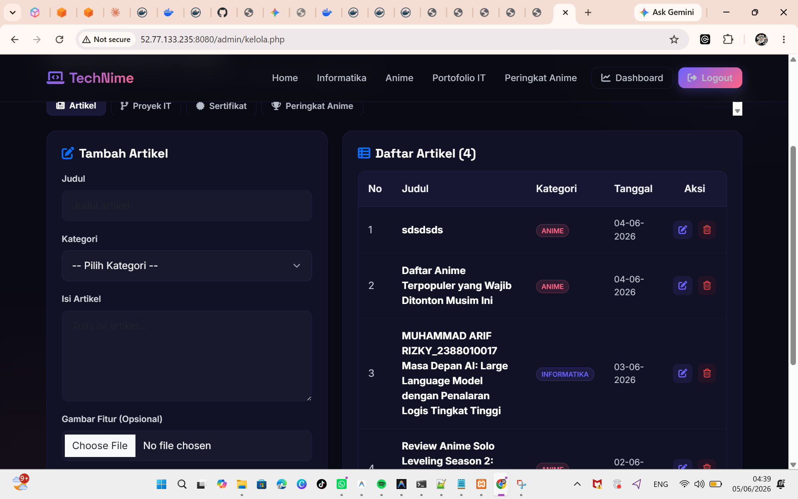
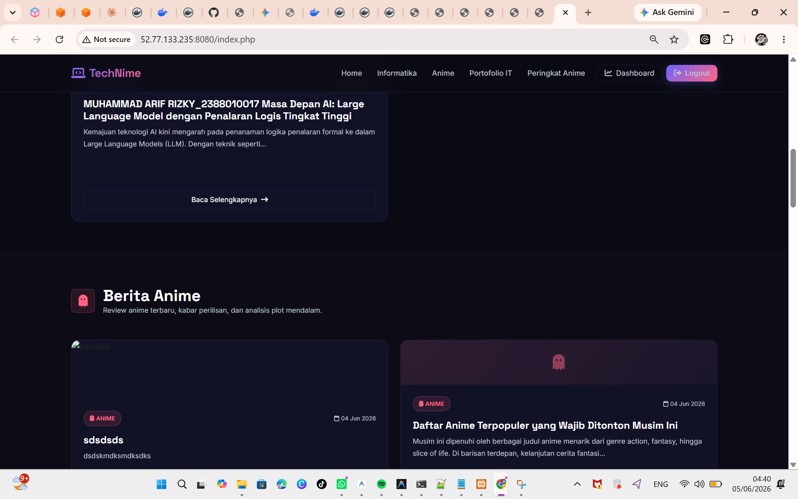
