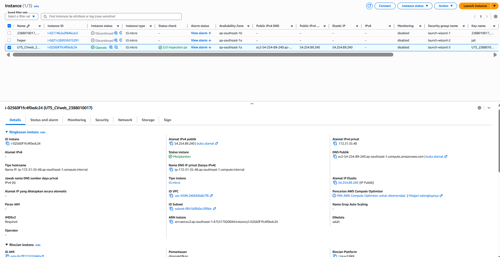
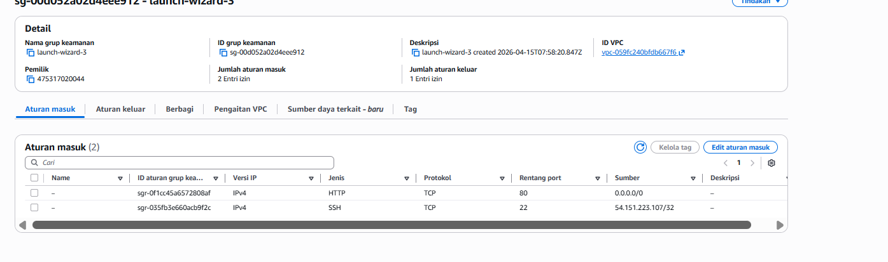
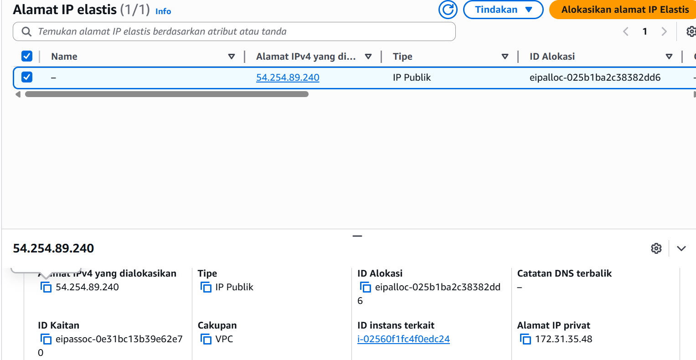
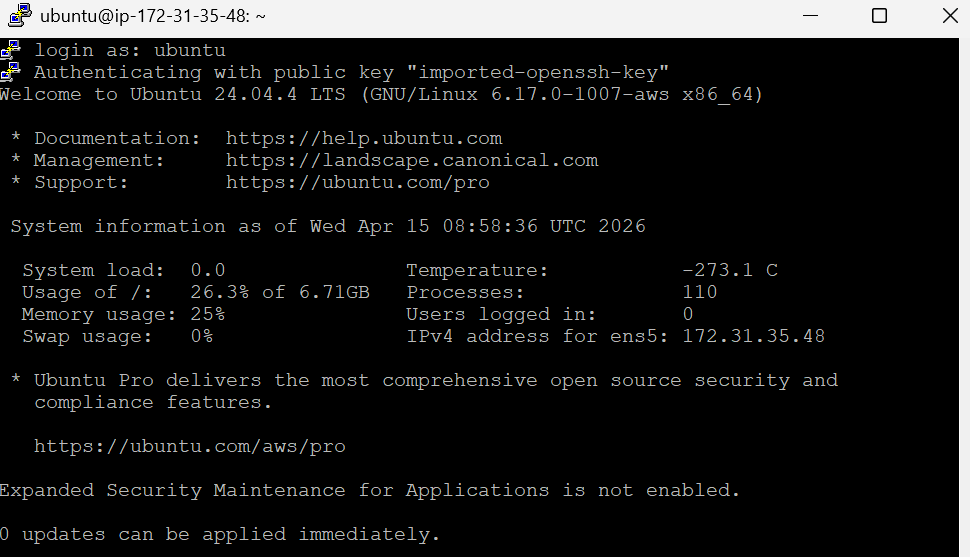
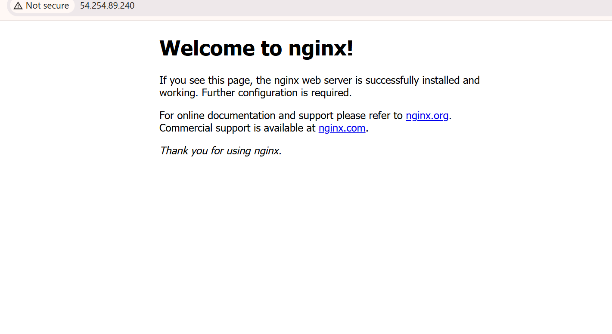
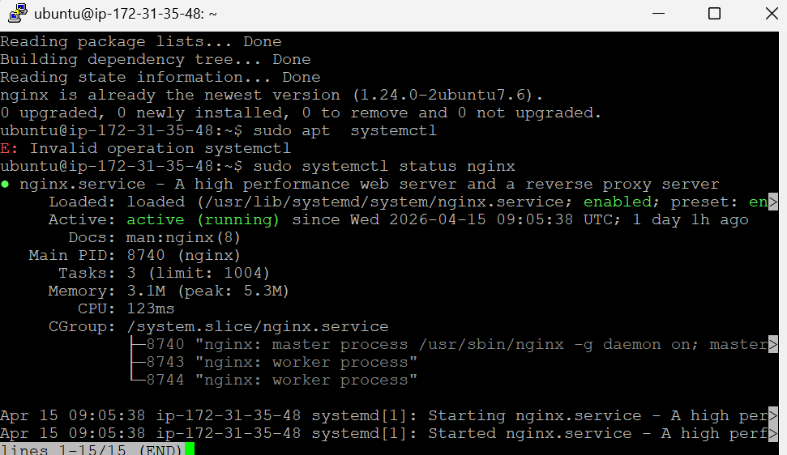
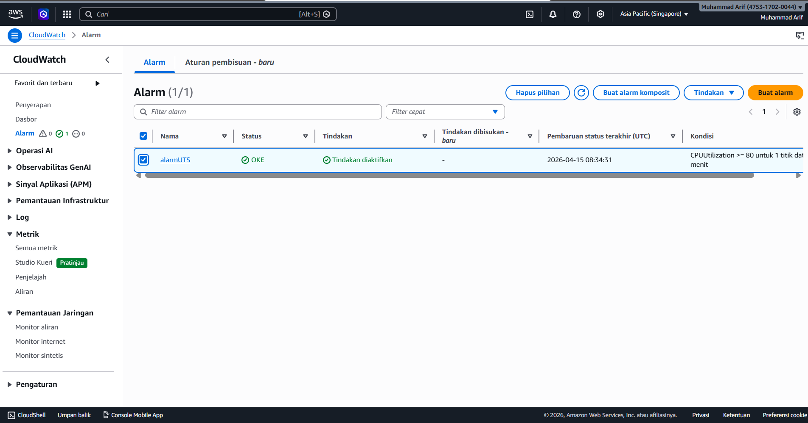
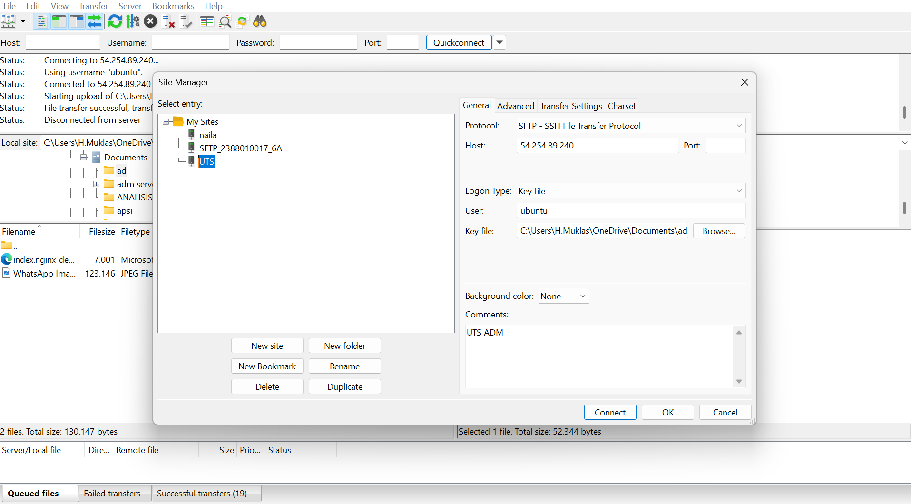
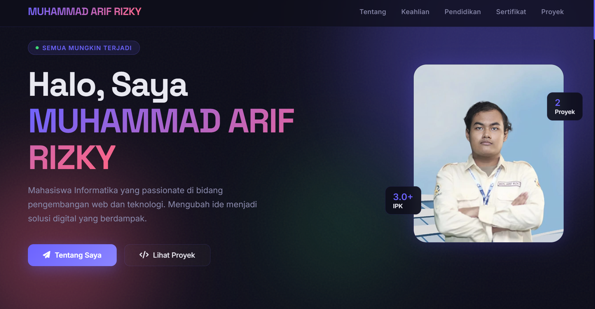

LAPORAN UTS Administrasi Server
Muhammad Arif Rizky | 2388010017 | Informatika 6A

1. Membuat Instance

2. Mengatur Security Group

3. Membuat IP ELASTIC

4. Masuk ke ubuntu pakai putty dan INSTALL NGINX 

5. membuat Alarm Cloud Watch CPU 80%+

Set up FileZilla

hasil web CV

